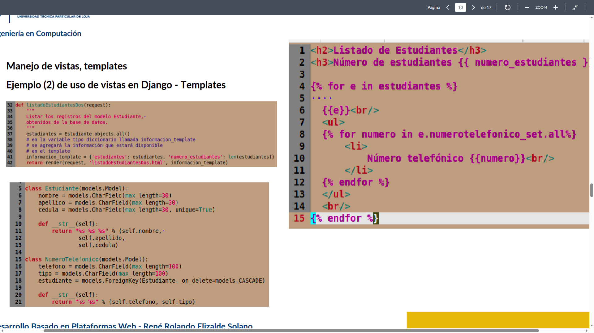

# clase03-2bim

Django automáticamente crea un nombre por defecto para acceder a objetos relacionados cuando defines una relación ForeignKey sin especificar related_name.

### 25 junio 2925
-Al agregar un nuevo numero de telefono a un estudiante, en views.py en la funcion de crear_numero_telefonico_estudiante el request al ser GET pasa directo al else del if que muestra el formulario vacío para ingresar el número telefónico del estudiante.
-Envia el formulario y los datos a crearNumeroTelefonicoEstudiante.html para mostrar al usuario y posterior a eso al confirmar vuelve a views para ejecutar nuevamente el metodo crear_numero_telefonico_estudiante ahora ya siendo un POST
-Se crea una instancia del formulario NumeroTelefonicoEstudianteForm con los datos enviados y si el formulario es válido, lo guarda y redirige a la vista index.